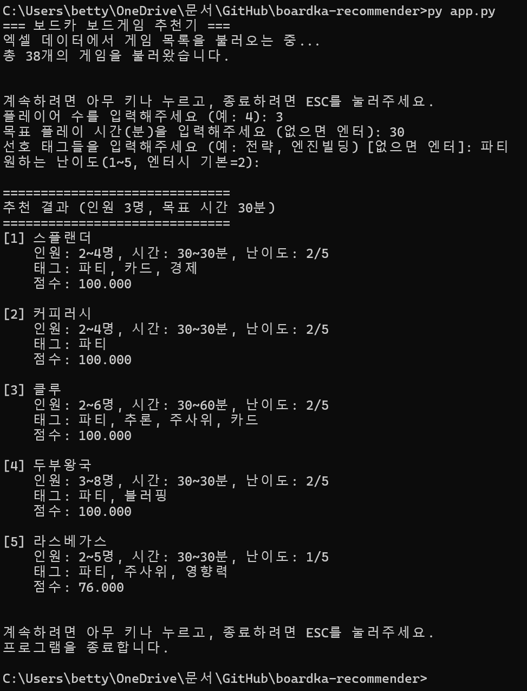
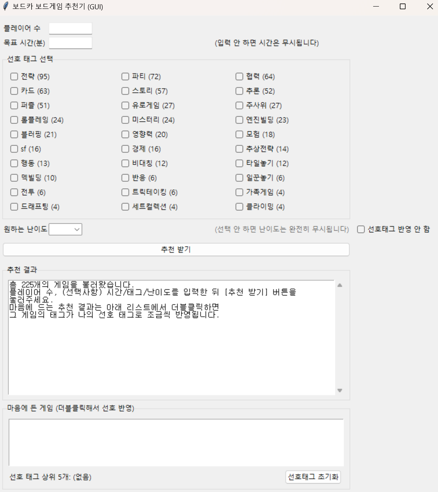
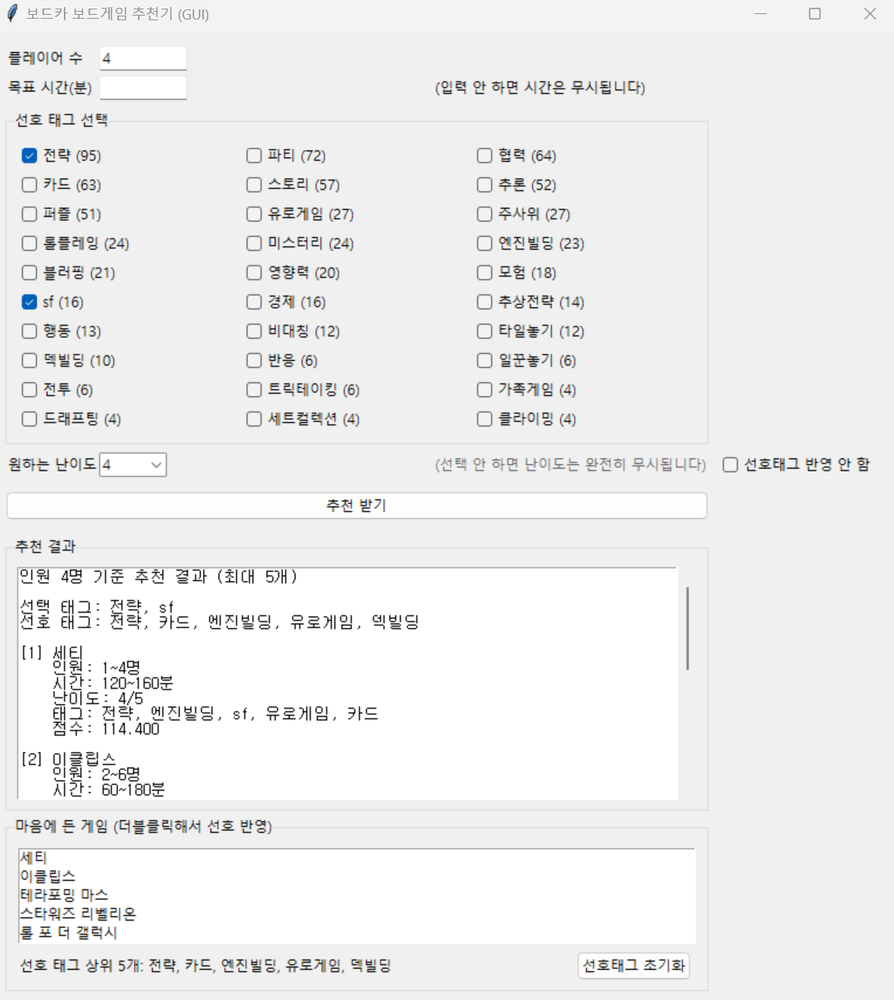
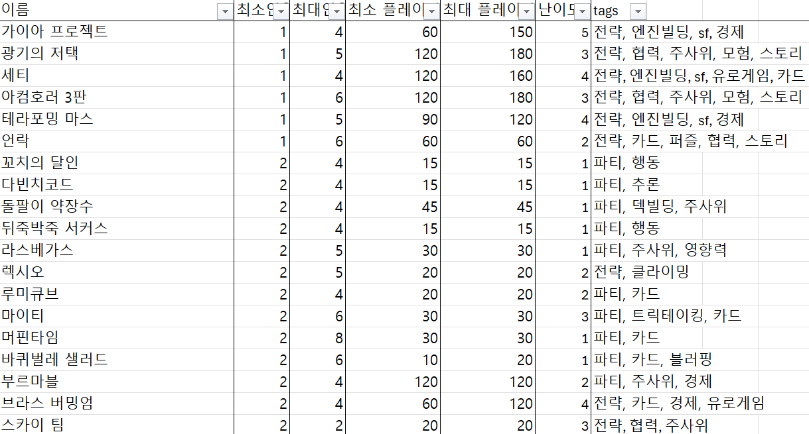

# Boardka Recommender

본 프로젝트는 보드게임 동아리 **보드카(BOARDKA\)**의 보드게임 데이터를 기반으로  
플레이어 수, 목표 시간, 태그, 난이도, 개인 선호도를 고려하여  
조건에 맞는 보드게임을 추천하는 Python 프로그램이다.

CLI(Command Line Interface) 버전과  
GUI(Graphical User Interface, tkinter 기반) 버전을 모두 지원한다.

---

## 1. 주요 기능

### 1.1 인원 기반 필터링
- 지정한 플레이어 수로 플레이 가능한 게임만 추천 대상에 포함된다.

### 1.2 시간 기반 필터링
- 시간 입력을 생략하면 시간 조건은 완전히 무시된다.
- 시간 입력 시:
  - 정확한 범위: 패널티 없음
  - ±30분 이내: 점수 30% 감소
  - ±30분 초과: 추천에서 제외

### 1.3 태그 기반 추천
- 엑셀 데이터의 태그 컬럼을 사용한다.
- GUI에서 태그를 체크박스 형태로 선택할 수 있다.
- 각 태그 옆에는 해당 태그가 사용된 게임 개수가 함께 표시된다.
- 게임 수가 3개 이하인 태그는 GUI 태그 목록에서 자동으로 숨긴다.
- 태그 점수 가중치는 최대 60점이다.

### 1.4 난이도 기반 추천
- 난이도는 1~5 사이의 정수이다.
- 난이도를 입력하지 않으면 난이도는 무시되며, 추천 점수에 영향을 주지 않는다.
- 난이도 점수 가중치는 최대 40점이다.

### 1.5 사용자 선호도 기반 추천 (학습 기능)
- GUI에서 추천 결과 리스트에 표시된 게임을 더블클릭하면,
  해당 게임에 달린 태그들의 선호도가 자동으로 +1씩 증가한다.
- 선호 태그 데이터는 `data/user_prefs.json` 파일에 저장되며,
  프로그램을 껐다 켜도 유지된다.
- 추천 시:
  - 사용자가 직접 선택한 태그(체크박스)가 우선적으로 사용된다.
  - 과거 클릭으로 쌓인 선호 태그는, 선택 태그에 비해 0.3배 비중으로 점수에 반영된다.
- GUI에서 다음 기능을 제공한다.
  - 선호 태그 상위 5개를 표시하는 영역
  - “선호태그 반영 안 함” 옵션
  - “선호태그 초기화” 버튼

### 1.6 추천 결과
- 최종 점수를 기준으로 상위 5개 게임을 추천한다.

---

## 2. 추천 알고리즘 개요

추천 점수는 다음 두 단계로 구성된다.

### (1) Base Score (0~100점)

- 태그 일치도: 최대 60점  
- 선호 태그 일치도: 최대 60점 × 0.3 (선택 태그보다 약하게 반영)  
- 난이도 일치도: 최대 40점 (난이도 입력 시에만 사용)

난이도 입력이 없는 경우, 난이도 점수는 계산되지 않는다.

### (2) Penalty 적용

- 플레이어 수가 맞지 않는 게임은 제외된다.
- 시간 미입력 시 패널티는 적용되지 않는다.
- 시간 입력 시:
  - 목표 시간과 게임 시간의 차이가 30분 초과 → 제외
  - 목표 시간과 게임 시간의 차이가 30분 이하 → 점수 30% 감소

**최종 점수 계산식**

final_score = base_score * penalty

---

## 3. 프로젝트 구조

boardka-recommender/

├─ app.py # CLI 인터페이스

├─ gui.py # GUI 인터페이스

├─ recommend.py # CLI 실행 스크립트

├─ data/

│ └─ GameList.xlsx # 보드게임 데이터

└─ boardka/

├─ models.py # Game 클래스 정의

├─ loader\_excel.py # 엑셀 데이터 로드

├─ recommender.py # 추천 엔진

└─ scoring.py # 점수 계산 로직

---

## 4. 실행 방법

### 4.1. 의존성 설치

py -m pip install pandas openpyxl

### 4.2. CLI 실행

py app.py

### 4.3. GUI 실행

py gui.py

(데모버전)

(최종본)

---

## 5. 데이터 형식 (GameList.xlsx)

엑셀 파일은 아래 열들을 포함해야 한다.

| 컬럼명       | 설명                  |
|-------------|-----------------------|
| name_ko     | 게임 이름(한글)        |
| min_players | 최소 인원             |
| max_players | 최대 인원             |
| min_time    | 최소 플레이 시간       |
| max_time    | 최대 플레이 시간       |
| difficulty  | 난이도(1~5)           |
| tags        | 쉼표로 구분된 태그 문자열 |

예시: 

---

## 6. 사용자 선호도 데이터(user_prefs.json)

GUI에서 추천 결과 리스트의 게임을 더블클릭하면,
그 게임에 설정된 태그들의 선호도가 자동으로 증가한다.

선호도 데이터는 data/user_prefs.json에 다음과 같은 형식으로 저장된다.

{
  "전략": 5,
  "엔진빌딩": 3,
  "퍼즐": 1
}

- 프로그램을 종료해도 데이터는 유지된다.
- GUI 하단의 “선호태그 초기화” 버튼으로 언제든 초기화할 수 있다.
- “선호태그 반영 안 함” 옵션을 통해, 선호 태그를 일시적으로 무시하는 것도 가능하다.

---

## 7. 참고한 자료

본 프로젝트는 외부 코드나 비공개 알고리즘 자료를 참고하지 않았습니다.

---

## 8. License

본 프로젝트는 MIT License를 따른다.

Copyright (c) 2025 이서현

Permission is hereby granted, free of charge, to any person obtaining a copy

of this software and associated documentation files (the "Software"), to deal

in the Software without restriction, including without limitation the rights   

to use, copy, modify, merge, publish, distribute, sublicense, and/or sell      

copies of the Software, and to permit persons to whom the Software is          

furnished to do so, subject to the following conditions:                       

The above copyright notice and this permission notice shall be included in all

copies or substantial portions of the Software.                                

THE SOFTWARE IS PROVIDED "AS IS", WITHOUT WARRANTY OF ANY KIND, EXPRESS OR     

IMPLIED, INCLUDING BUT NOT LIMITED TO THE WARRANTIES OF MERCHANTABILITY,       

FITNESS FOR A PARTICULAR PURPOSE AND NONINFRINGEMENT. IN NO EVENT SHALL THE    

AUTHORS OR COPYRIGHT HOLDERS BE LIABLE FOR ANY CLAIM, DAMAGES OR OTHER         

LIABILITY, WHETHER IN AN ACTION OF CONTRACT, TORT OR OTHERWISE, ARISING FROM,  

OUT OF OR IN CONNECTION WITH THE SOFTWARE OR THE USE OR OTHER DEALINGS IN THE 

SOFTWARE.

---

## 9. 향후 개선 가능성

- 태그 자동 추천 기능 (게임 설명/규칙 텍스트 기반 자연어 처리)

- 게임 간 유사도 기반 추천 

- 웹 기반 UI 추가

