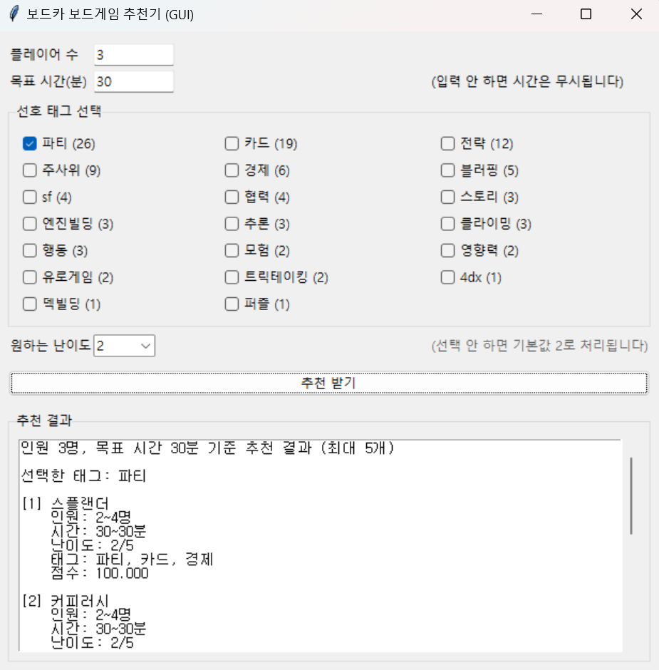

# Boardka Recommender

본 프로젝트는 보드게임 동아리 보드카(BOARDKA)의 게임 데이터를 기반으로  

플레이어 수, 목표 플레이 시간, 선호 태그, 난이도 등을 입력받아  

조건에 맞는 보드게임을 추천하는 Python 프로그램이다.

CLI(Command Line Interface) 버전과 GUI(Graphical User Interface) 버전 모두 제공한다.

---

## 1. 주요 기능

- **플레이어 수 필터링**  

&nbsp; 지정된 인원에서 플레이 가능한 게임만 선택된다.

- **플레이 시간 필터링**  

&nbsp; 시간 입력 시 ±30분 범위까지 허용하며, 범위 내에서는 가중치가 감소한다.  

&nbsp; 시간 입력을 생략하면 시간 조건은 완전히 무시된다.

- **태그 기반 추천**  

&nbsp; 태그별 게임 개수를 자동 계산하여 GUI에서 체크박스로 제공한다.  

&nbsp; 태그 가중치는 최대 60점이다.

- **난이도 기반 추천**  

&nbsp; 난이도는 1~5 사이 정수이며, 입력하지 않을 경우 기본값 2로 간주한다.  

&nbsp; 난이도 가중치는 최대 40점이다.

- **추천 결과**  

&nbsp; 최종적으로 계산된 점수를 기준으로 상위 5개의 게임을 출력한다.

---

## 2. 추천 알고리즘 개요

추천 점수는 다음 두 단계로 구성된다.

### (1) Base Score (0~100점)

- 태그 일치도: 최대 60점  

- 난이도 일치도: 최대 40점

### (2) Penalty 적용

- 플레이어 수가 맞지 않을 경우 해당 게임은 제외된다.

- 시간 미입력 시 패널티 없음.

- 시간 입력 시  

&nbsp; - 정확한 범위: 패널티 없음  

&nbsp; - ±30분 이내: 점수 30% 감소  

&nbsp; - 범위 초과: 제외  

**최종 점수 계산식**

final\_score = base_score \* penalty

---

## 3. 프로젝트 구조

boardka-recommender/

├─ app.py # CLI 인터페이스

├─ gui.py # GUI 인터페이스

├─ recommend.py # CLI 실행 스크립트

├─ data/

│ └─ GameList.xlsx # 보드게임 데이터

└─ boardka/

├─ models.py # Game 클래스 정의

├─ loader\_excel.py # 엑셀 데이터 로드

├─ recommender.py # 추천 엔진

└─ scoring.py # 점수 계산 로직

---

## 4. 실행 방법

### 4.1. 의존성 설치

py -m pip install pandas openpyxl

### 4.2. CLI 실행

py app.py

### 4.3. GUI 실행

py gui.py

---

## 5. 데이터 형식 (GameList.xlsx)

엑셀 파일은 아래 열들을 포함해야 한다.

| 컬럼명 | 설명 |

|--------|------|

| name\_ko | 게임 이름(한글) |

| min\_players | 최소 인원 |

| max\_players | 최대 인원 |

| min\_time | 최소 플레이 시간 |

| max\_time | 최대 플레이 시간 |

| difficulty | 난이도(1~5) |

| tags | 쉼표로 구분된 태그 문자열 |

예시: 

---

## 6. 참고한 자료

본 프로젝트는 외부 코드나 비공개 알고리즘 자료를 참고하지 않았습니다.

---

## 7. License

본 프로젝트는 MIT License를 따른다.

Copyright (c) 2025 이서현

Permission is hereby granted, free of charge, to any person obtaining a copy

of this software and associated documentation files (the "Software"), to deal

in the Software without restriction, including without limitation the rights   

to use, copy, modify, merge, publish, distribute, sublicense, and/or sell      

copies of the Software, and to permit persons to whom the Software is          

furnished to do so, subject to the following conditions:                       

The above copyright notice and this permission notice shall be included in all

copies or substantial portions of the Software.                                

THE SOFTWARE IS PROVIDED "AS IS", WITHOUT WARRANTY OF ANY KIND, EXPRESS OR     

IMPLIED, INCLUDING BUT NOT LIMITED TO THE WARRANTIES OF MERCHANTABILITY,       

FITNESS FOR A PARTICULAR PURPOSE AND NONINFRINGEMENT. IN NO EVENT SHALL THE    

AUTHORS OR COPYRIGHT HOLDERS BE LIABLE FOR ANY CLAIM, DAMAGES OR OTHER         

LIABILITY, WHETHER IN AN ACTION OF CONTRACT, TORT OR OTHERWISE, ARISING FROM,  

OUT OF OR IN CONNECTION WITH THE SOFTWARE OR THE USE OR OTHER DEALINGS IN THE 

SOFTWARE.

---

## 8. 향후 개선 가능성

- 태그 자동 추천 기능  

- 사용자 선호도 학습 기능  

- 웹 기반 UI 추가 가능성  

